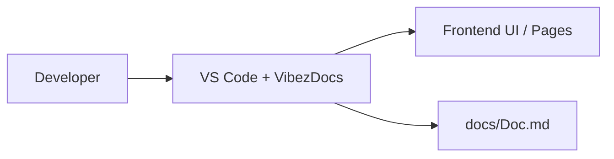

# VibezDocs

## Architecture
- frontend component activity detected in src/components/Team.tsx
- frontend component activity detected in src/cyclone/Team.tsx
- • **Updated Team Component**: The Team.tsx file in src/cyclone has been updated with 2 new changes, adding functionality to dis...
- • **Added Team Member Data**: The updated Team.tsx file includes data for 4 team members, showcasing their names, roles, bios,...

## APIs
- (none yet)

## Components
- Component update in src/components/Team.tsx: import { motion } from 'framer-motion';
- Component update in src/cyclone/Team.tsx: import { motion } from 'framer-motion';

## Database
- (none yet)

## Pages
- (none yet)

## Development Timeline
- 2026-03-30T14:38:51.779Z: Updated in src/components/Team.tsx (component)
- 2026-03-30T14:39:02.105Z: Updated in src/cyclone/Team.tsx (component)

## C4 Diagram (Mermaid format)

